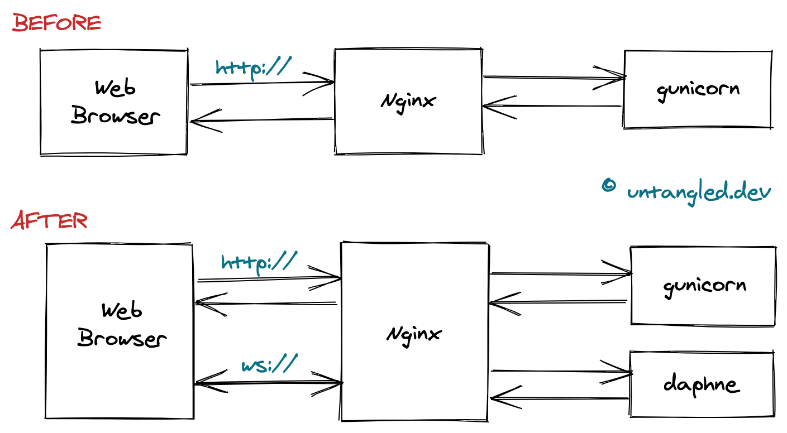

# Websockets with Django in production
https://www.untangled.dev/2020/08/02/django-websockets-minimal-setup/

Note: "http" request protocol below refers both to "http" and "https". Same applies to "ws" and "wss". Assume that for local development the protocol is unsecure, whilst secure in production.

Before introducing websockets, the web browser made an "http" request to Nginx. At this point Nginx serves the request using "gunicorn", hitting Django.

After adding websockets in the mix, Nginx still serves "http" requests. But it’s now able to serve "ws" requests by talking to "daphne". In this case you can replace "daphne" with any other "Websocket termination server":

